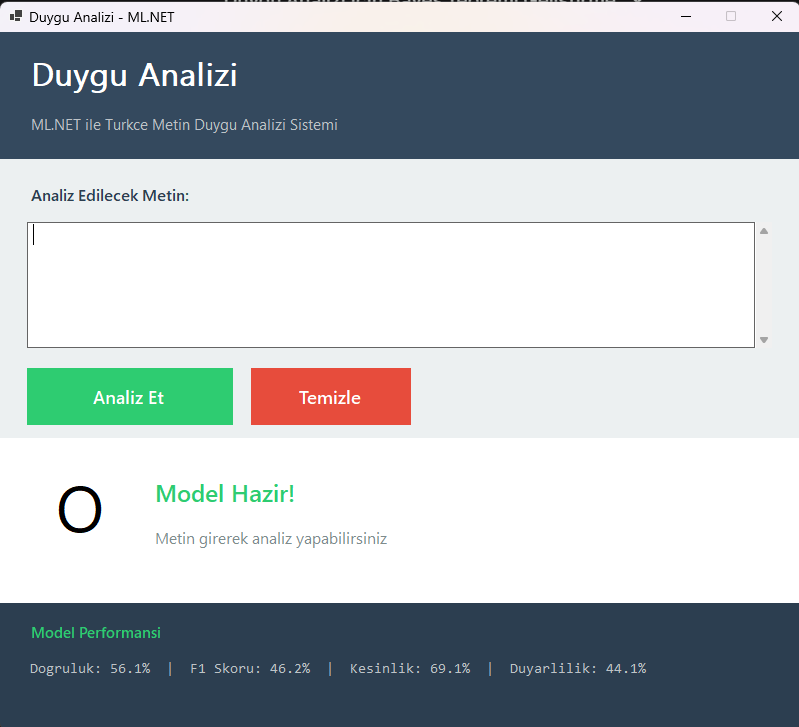
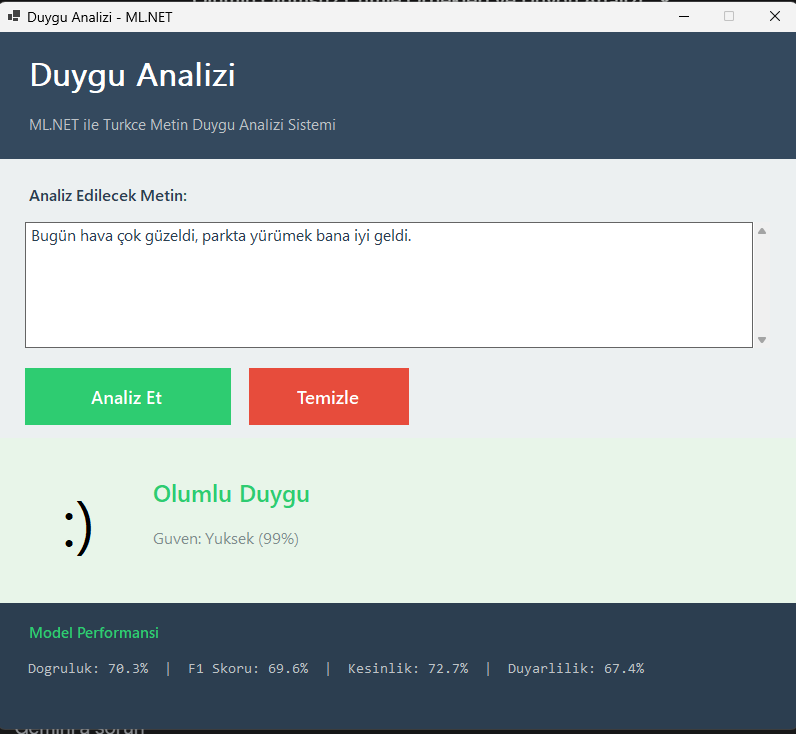
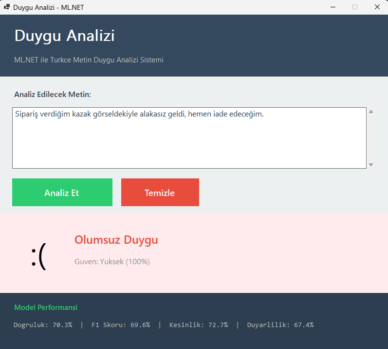

# Duygu Analizi (Sentiment Analysis)

Nesne Tabanli Programlama dersi odevi olarak hazirlanan, ML (Machine Learning) ve metin isleme konularinda alistirma yapmak amaciyla gelistirilmis bir Windows Forms uygulamasi.

## Proje Hakkinda

Bu proje, Turkce metinlerin duygu analizini yapmak icin **ML.NET** ve **Naive Bayes** algoritmalarini kullanan hibrit bir yaklasim sunmaktadir. Kullanici tarafindan girilen metinler "Olumlu" veya "Olumsuz" olarak siniflandirilir.

### Kullanilan Teknolojiler
- .NET 8
- Windows Forms
- ML.NET (SDCA Logistic Regression)
- Naive Bayes Classifier

## Program Akisi

```
[Kullanici Metni Girer]
         |
         v
[TextPreprocessor - Metin Temizleme]
         |
         v
[Anahtar Kelime Analizi] + [ML.NET Tahmini]
         |
         v
[Hibrit Karar (Agirlikli Ortalama)]
         |
         v
[Sonuc: Olumlu / Olumsuz + Guven Skoru]
```

## Ekran Goruntuleri

| Ana Ekran | Olumlu Sonuc | Olumsuz Sonuc |
|-----------|--------------|---------------|
|  |  |  |

## Referans

Bu proje gelistirilirken asagidaki kaynak referans alinmistir:

- [Duygu Analizi Sistemini Iyilestirme Plani](https://github.com/BilalAbic/SentimentAnalysis/raw/7341510f7cca4dd39430d8871000f3a5231dfa84/SentimentAnalysis/docs/Duygu%20Analizi%20Sistemini%20İyileştirme%20Planı.pdf) *(Gemini AI ile hazirlanmistir)*

## Indirme

Programi buradan indirebilirsiniz: [Releases](https://github.com/BilalAbic/SentimentAnalysis/releases)

## Lisans

Bu proje egitim amacli hazirlanmistir.
